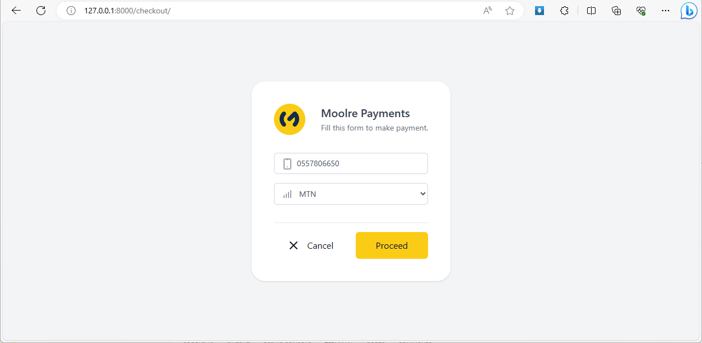
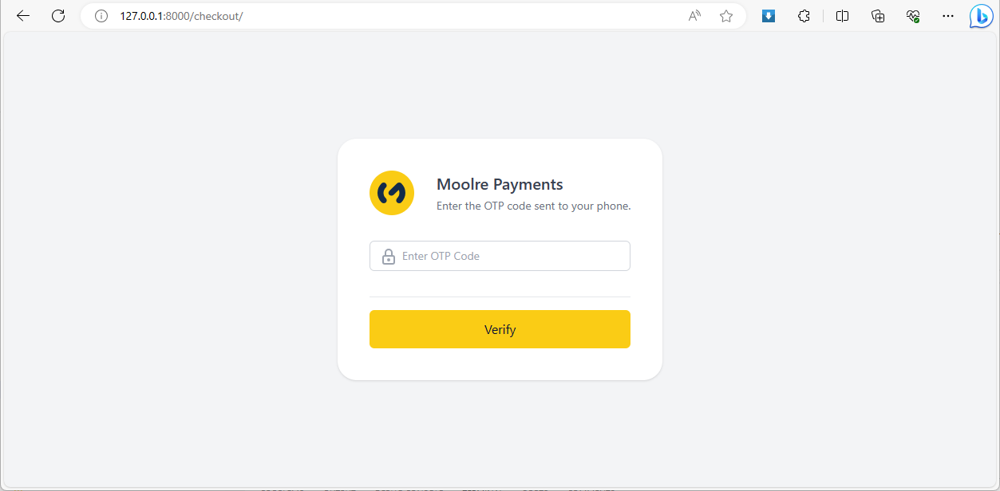
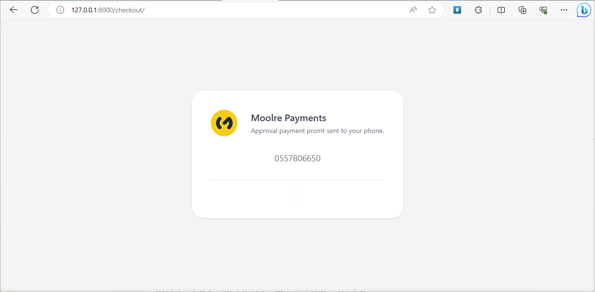

# Moolre Payments

A Moolre Payments Application.

[Laravel](https://laravel.com) version 10.







## Instructions
After coping the repo, configure the your server's database in the .env file:
```dart
DB_CONNECTION=mysql
DB_HOST=localhost
DB_PORT=3306
DB_DATABASE=paymentgateway
DB_USERNAME=moorel_user
DB_PASSWORD=############
```

Run the following cmd command to migrate the database:
```dart
php artisan migrate
```

Update packages in the repo folder:

Run the following cmd command to migrate the database:
```dart
composer update
```

Go into the resources\frontend\moolre\src\app\service\app-settings.ts angular file and change the HOST_URL to your domain name:
```dart
public static get hostURL(): string {
    return 'https://mydomain.com';
}
```

Update angular and packages in 
resources\frontend\moolre folder:

```dart
npm install
```

Inside the resources\frontend\moolre folder, run the following command:
```dart
ng build 
```

Your application is ready for use.


# Contribute

If you would like to contribute to the app, please contact us.


# Support

* Powered by: [x-imious](https://x-imious.ml)
